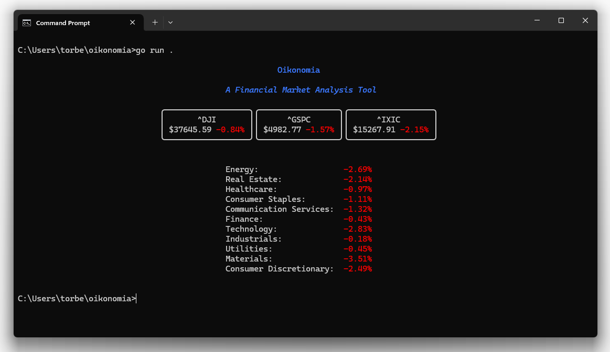

# Oikonomia
_A Command Line Application for Analyzing Financial Markets_

## Installation

```bash
go install github.com/torbenconto/oikonomia
```

## Usage

For a quick market overview, run the following command:
```bash
oikonomia
```

This will display a summary of the current market status, including the S&P 500 index, the Dow Jones Industrial Average, and the Nasdaq Composite.



You can also specify a specific stock symbol to get detailed information about that stock. For example, to get information about Apple Inc. (AAPL), run:
```bash
oikonomia AAPL
```
This will display the current price, market cap, avg. volume, and other relevant information about Apple Inc.

